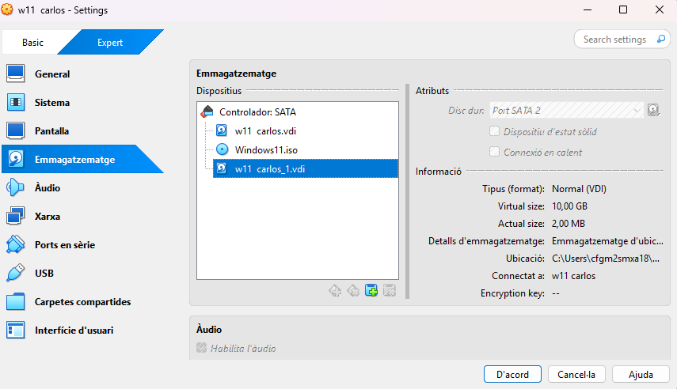

# Guia de Còpies de Seguretat (Windows + Linux)
Objectiu
Implementar una política de còpies de seguretat seguint l’esquema 3-2-1 utilitzant:
Duplicati a Windows 11 (disc secundari + Google Drive)
Duplicity a Ubuntu Server (disc extern + scripts + cron)

## Part 1 — Backup a Windows 11 amb Duplicati
### 1 Preparació

Crear una màquina virtual Windows 11.
Afegir un disc secundari de 10 GB i formatar-lo.

### 2Instal·lació de Duplicati
Baixar-lo des de https://duplicati.com
Instal·lar-lo i obrir la interfície web.

(IMATGE 2)

 ### 3 Configuració del backup local

Crear un backup nou.
Carpetes a copiar: Perfil d'usuari (Documents, etc.)
Destí: D:\Backup
Programació: cada hora

(IMATGE 3)

### 4 Backup al núvol (Google Drive)
Crear una segona tasca.
Destí: Google Drive → autoritzar compte.
Hora d’execució: 18:00

(IMATGE 4)

### 5️ Restauració

Afegir fitxers a Documents.
Esperar la còpia.
Esborrar Documents.
Restaurar des del disc local.
Restaurar també des del núvol per provar.

(IMATGE 5)

## Part 2 — Backup a Ubuntu Server amb Duplicity
### 1️ Preparar disc de backup
sudo mkfs.xfs /dev/sdb
sudo mkdir /media/backup
sudo mount /dev/sdb /media/backup

( imatge 6)

### 2 Instal·lar Duplicity
sudo apt install duplicity

(imatge 7)

### 3️ Crear dades de prova

Afegir usuaris nous.
Crear 4 arxius de 10 MB a /home/usuari.

(imatge 8)
### 4️ Còpia completa
duplicity /home file:///media/backup

(imateg 9)
### 5️ Restauració
duplicity restore file:///media/backup /home

(imatge 10)
### 6️ Còpia incremental

Crear arxiu de 4 MB

duplicity incremental /home file:///media/backup

🔧 Automatització amb scripts + cron
fullbackup.sh
export PASSPHRASE="contrasenya"
mount /dev/sdb /media/backup
duplicity full /home file:///media/backup
umount /media/backup

Cron (cada diumenge a les 23:00):

0 23 * * 0 root /root/fullbackup.sh

incrementalbackup.sh
export PASSPHRASE="contrasenya"
mount /dev/sdb /media/backup
duplicity incremental /home file:///media/backup
umount /media/backup

Cron (dilluns a dissabte 23:00):

0 23 * * 1-6 root /root/incrementalbackup.sh

(imatge 11)
