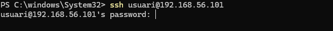
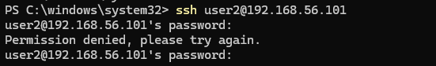
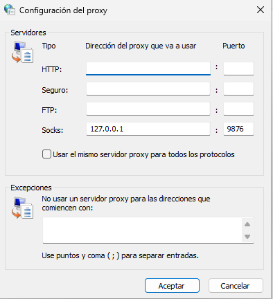
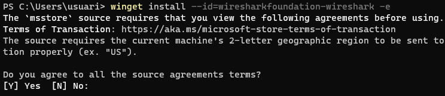
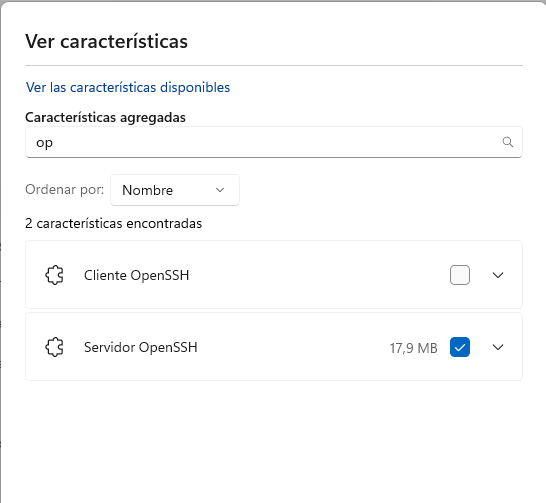

#   SSH — Guia Completa amb Evidències (Activitat T05)

## 1. Descripció de l’Activitat

El propòsit d’aquesta activitat és aprendre i documentar com establir connexions SSH entre clients i servidors en un entorn segur simulat amb màquines virtuals.

### Objectius principals:
- Crear un entorn amb 3 màquines virtuals:
  - **Client Windows**
  - **Servidor Linux amb SSH actiu**
- Realitzar connexions SSH des de Linux i Windows.
- Comprovar el funcionament del protocol.
- Registrar el procés amb captures de pantalla.
- Deixar un document que servirà de base per a futurs becaris de la consultora.

---

## 2. Entorn de Proves

| Màquina | Sistema | Rol |
|--------|---------|-----|
| Client Windows | Windows 10/11 | Origen de connexió SSH |
| Servidor Linux | Ubuntu / Debian | Destí de la connexió SSH |

### instalacio de shh al servidor 
El primer pas per permetre connexions remotes és assegurar que el servidor Linux tingui instal·lat el servei OpenSSH Server, que és el paquet responsable de rebre i gestionar connexions SSH entrants.
L’ordre següent instal·la el servidor SSH en sistemes basats en Ubuntu/Debian:
``` bash
sudo apt install ssh
```

Per verificar que el servei SSH està en funcionament al servidor, s’utilitza la comanda:

### L'estat d' el ssh 
``` bash
sudo systemctl status ssh
```

En aquest pas, ens connectem des del nostre equip Windows al servidor Linux utilitzant el client SSH incorporat a PowerShell o Windows Terminal.
## ens conectem al servidor per ssh 
``` bash
ssh usuari@IP servidor
```



## Creem el segon usuari
Per afegir un nou usuari al servidor, utilitzem la comanda:
``` bash
sudo adduser nomdelusuari
```


## modificar el archiu /etc/ssh/ssh_config
Per configurar opcions generals del client SSH al servidor (o a la màquina local), editem el fitxer de configuració:
```bash
sudo nano /etc/ssh/ssh_config
```


## intentem fer ssh amb user2ç
Per intentar connectar-nos amb el nou usuari (user2) al servidor, utilitzem:
```bash
ssh user2@IP servidor
```


## 3 client w11
### 1.3 Pont segur entre el client y el servidor
Per establir un túnel o pont segur des del client Windows 11 al servidor Linux, utilitzem la comanda següent:
```bash
ssh -D 9876 usuari@IP servidor
```
.png)

###1.4 confuguracio d' internet 
En aquest pas es comprova i ajusta la configuració de connexió a Internet del client Windows 11 per tal que el túnel SSH creat anteriorment funcioni correctament. Això inclou:

Configurar el navegador o aplicacions perquè utilitzin el proxy SOCKS creat al port 9876 del client.

Verificar que tot el tràfic passant pel túnel SSH és xifrat i passa pel servidor Linux.

Comprovar que la connexió a Internet és estable i que no hi ha bloquejos de xarxa que impedeixin l’ús del túnel.




###1.5 Instalacio del wireshark
Per monitoritzar i analitzar el tràfic de xarxa al client Windows 11, instal·lem Wireshark utilitzant winget:
``` bash
winget install --id=wiresharkfundation-wireshark -e
```


### 1.6 Capturar paquets del ssh 
Per verificar que la connexió SSH és segura i xifrada, utilitzem Wireshark per capturar el tràfic entre el client Windows 11 i el servidor Linux.


### 1.6 Afeguir open ssh
Per permetre que el sistema Windows 11 accepti connexions SSH entrants, cal instal·lar OpenSSH Server:


### 1.7 Executem Start-Service sshd
Per posar en marxa el servei OpenSSH Server a Windows 11, utilitzem la comanda:
``` bash
Start-Service sshd
```


### 1.8 Executem Set-Service -Name sshd -StartupType "Automatic"
Per assegurar que el servei OpenSSH Server s’iniciï automàticament cada cop que s’arranca Windows 11, utilitzem la comanda:
``` bash
Set-Service -Name sshd -StartupType "Automatic"
```

