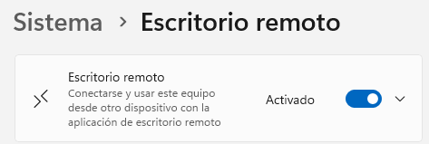

# Guia d’Escriptori Remot: Zorin → Windows
## 1. Configurar l’Escriptori Remot a Windows
###1.1 Accedir a la configuració

Obrim el menú Inici a Windows i escrivim “Escriptori remot”.
Seleccionem Configuració d’Escriptori remot.

(afegir imatge: finestra de configuració d’escriptori remot)

### 1.2 Habilitar l’Escriptori remot
Activem l’opció Habilitar l’escriptori remot.
Això permetrà que altres equips puguin connectar-s’hi.
(afegir imatge: interruptor per habilitar l’escriptori remot)

### 1.3 Afegir usuaris autoritzats
Premem Seleccionar usuaris que poden accedir a aquest ordinador.
Afegim els usuaris amb el format: NomDelOrdinador\Usuari.
Premem Aceptar.

(afegir imatge: finestra per afegir usuaris)

## 2. Connectar-nos des de Zorin
### 2.1 Comprovar connexió entre equips
Assegurem-nos que tant Zorin com Windows estan a la mateixa xarxa i es poden veure entre ells.
(afegir imatge: comprovació de connexió, per exemple ping o explorador de xarxa)

### 2.2 Obrir el client d’Escriptori Remot
A Zorin, obrim el programa Remmina (o un altre client RDP).

(afegir imatge: icona de Remmina o finestra oberta)

### 2.3 Introduir la informació del Windows

En la barra superior de Remmina, escrivim el nom de l’ordinador Windows amb format:
nomdelordinador.local

(afegir imatge: camp on posar el nom del PC)

### 2.4 Posar les credencials d’usuari
Introduïm el nom d’usuari i contrasenya que hem afegit abans a Windows.
Premem Connectar.

