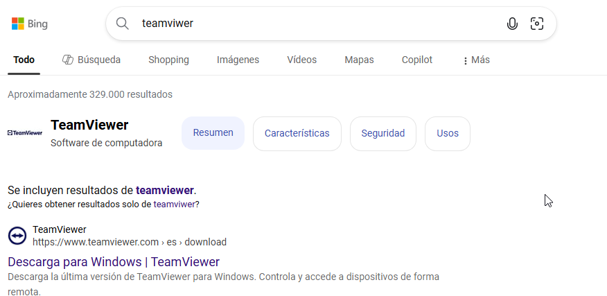
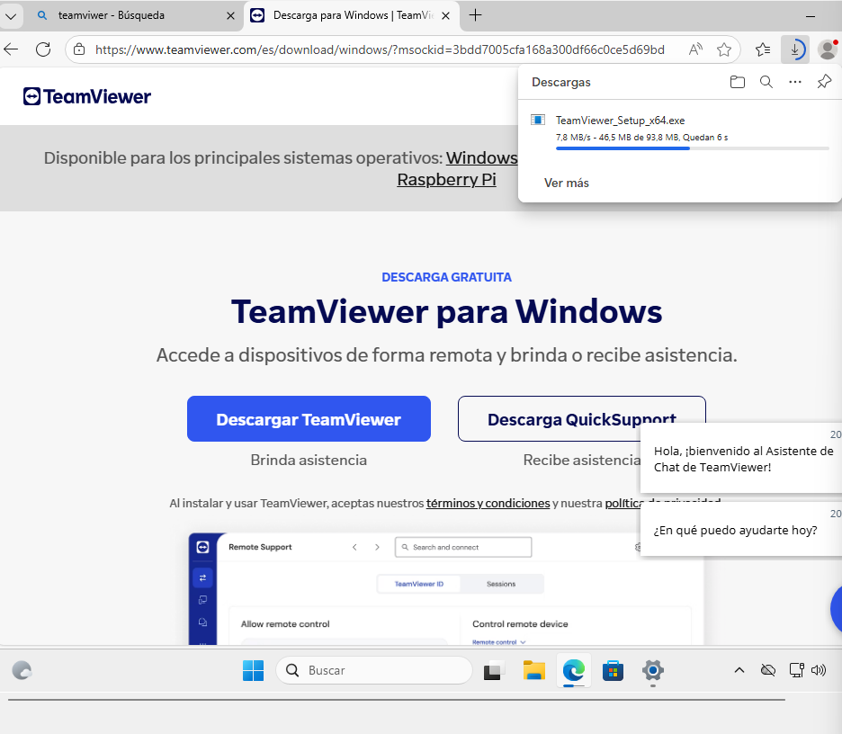
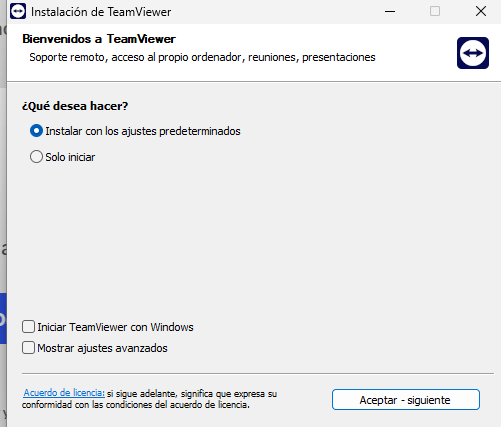
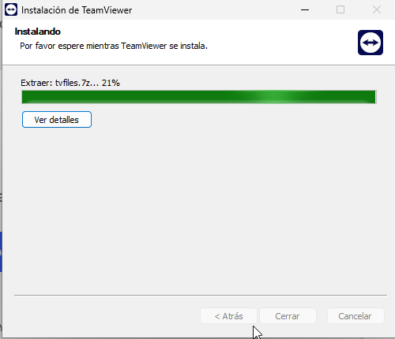
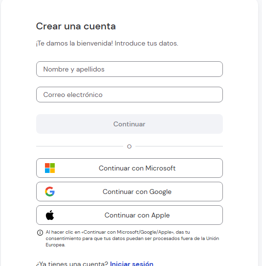
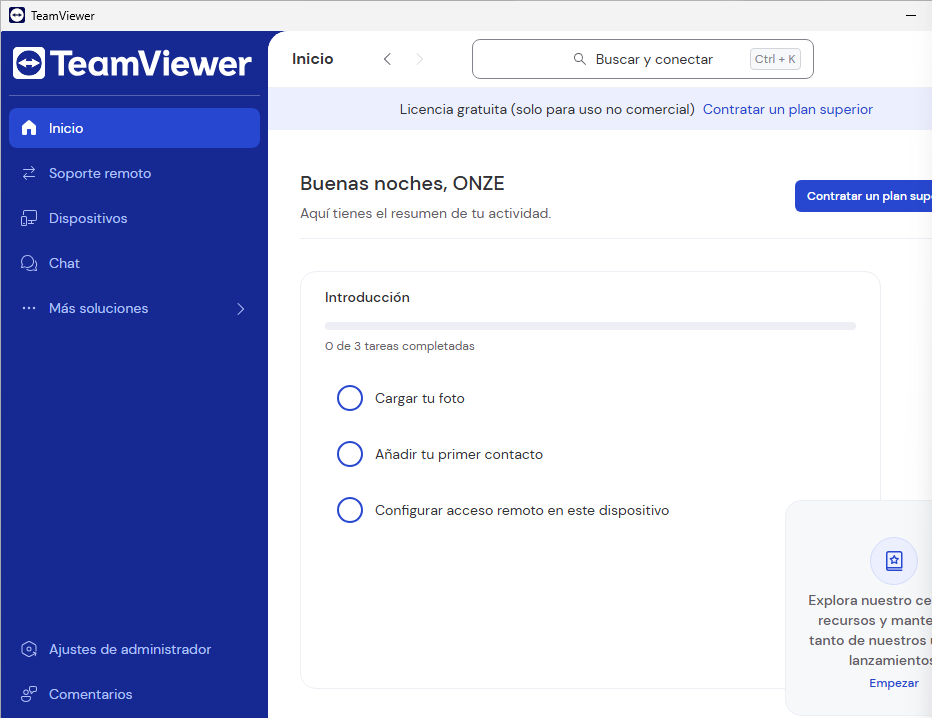
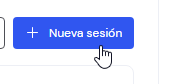
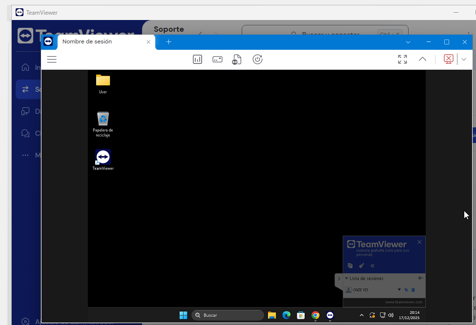

# T07: Accés remot. Serveis d’assistència remota
### Fet per: Pau Guerrero i Vicenç Obiol
---
# Guia de connexió remota amb TeamViewer (visió del tècnic)

---

Cerco **TeamViewer** des de qualsevol navegador per poder connectar-me de manera ràpida i segura a l’equip del client. Aquesta eina em permet veure i controlar el seu ordinador sense que hagi de realitzar configuracions complicades.

---

Accedeixo a la **pàgina web oficial de TeamViewer** i en faig la descàrrega des d’allà, assegurant-me d’utilitzar sempre la versió més segura i actualitzada.

---

Espero que la **descàrrega finalitzi correctament** abans d’iniciar la instal·lació del programa.

---

Executo l’instal·lador i faig clic a **“Acceptar i continuar”** per començar la instal·lació al meu equip.

---

Accepto els **acords i condicions** i continuo amb el procés d’instal·lació, garantint que el programari funcioni correctament i de manera segura.

---

Quan arribo a la pantalla principal, **creo un compte de TeamViewer** si és la primera vegada que utilitzo l’eina. Si ja disposo d’un compte, simplement inicio sessió amb les meves credencials.

---

Un cop dins, accedeixo a la **pàgina principal del meu usuari**, des d’on puc iniciar sessions de suport remot o unir-me a sessions ja existents.

---

Des del **menú lateral esquerre**, selecciono l’opció **“Suport remot”** i faig clic a **“Unir-se a una sessió”** per connectar-me immediatament a l’ordinador del client.

---

Per establir la connexió, **introdueixo el codi de sessió** que em facilita el client. A continuació, sol·licito i espero la seva autorització per poder accedir i treballar de manera remota al seu dispositiu.

---

Un cop concedit el permís, la connexió queda establerta i **puc controlar l’equip del client sense problemes**, realitzant les tasques de suport necessàries.

---

## Recomanacions per a sessions segures (com a tècnic)

- **No desar les contrasenyes del client**: cada sessió genera una contrasenya nova per mantenir la seguretat.
- **Tancar sempre la sessió** en finalitzar el suport per evitar accessos no autoritzats.
- **Utilitzar l’accés mitjançant compte** per a clients recurrents, configurant accés fàcil i sistemes d’autenticació segurs.
- **Informar sempre el client** de les accions que es realitzaran durant la sessió, mantenint transparència i confiança.

---

Aquesta metodologia em permet oferir un suport remot eficient, professional i segur.

