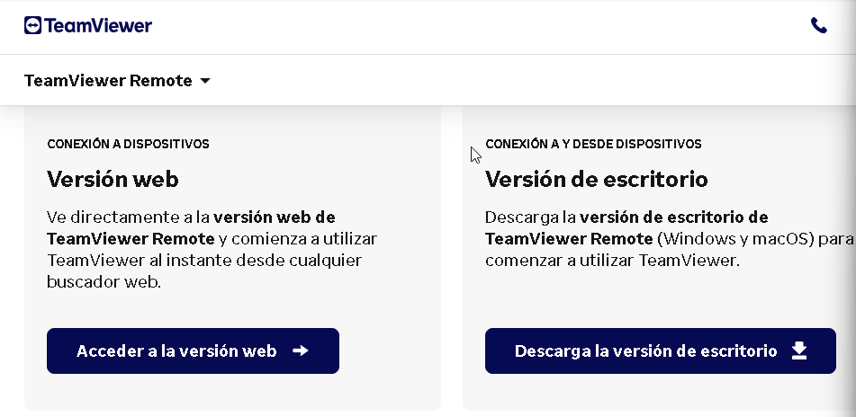
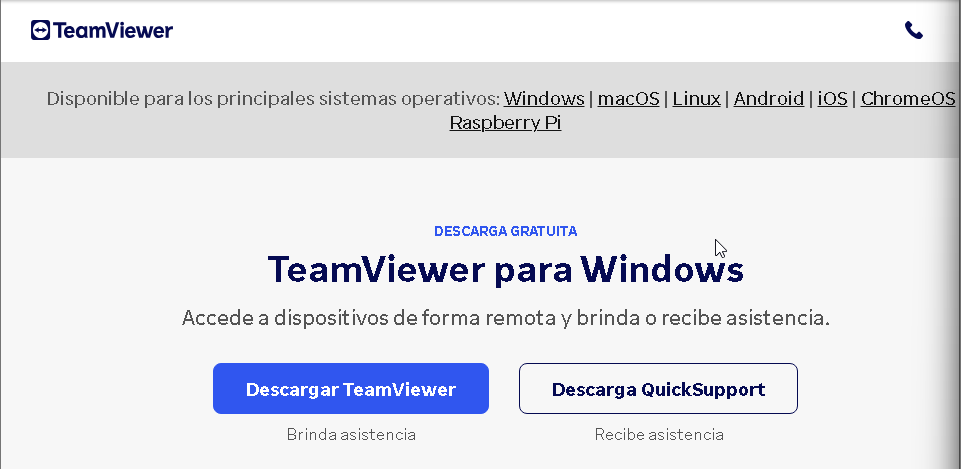
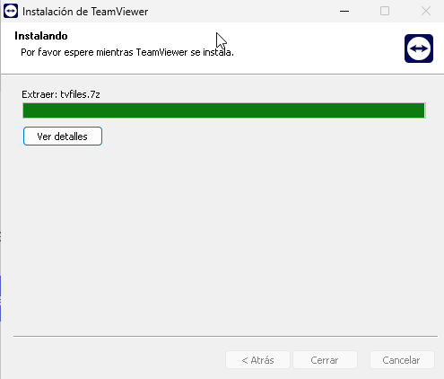
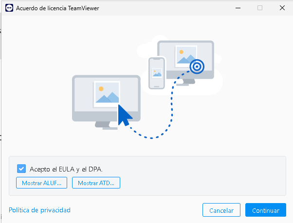
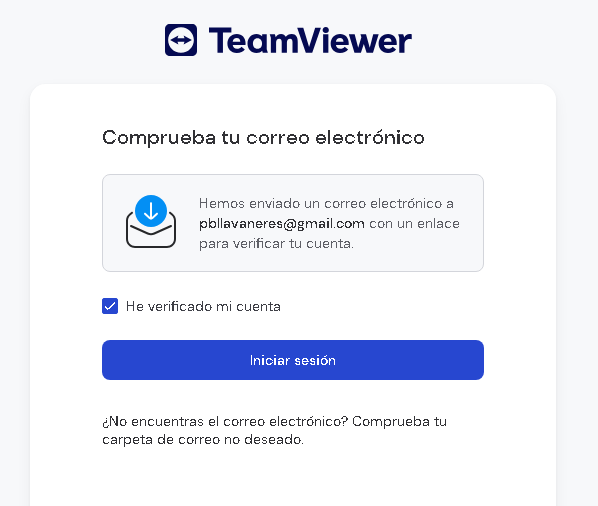
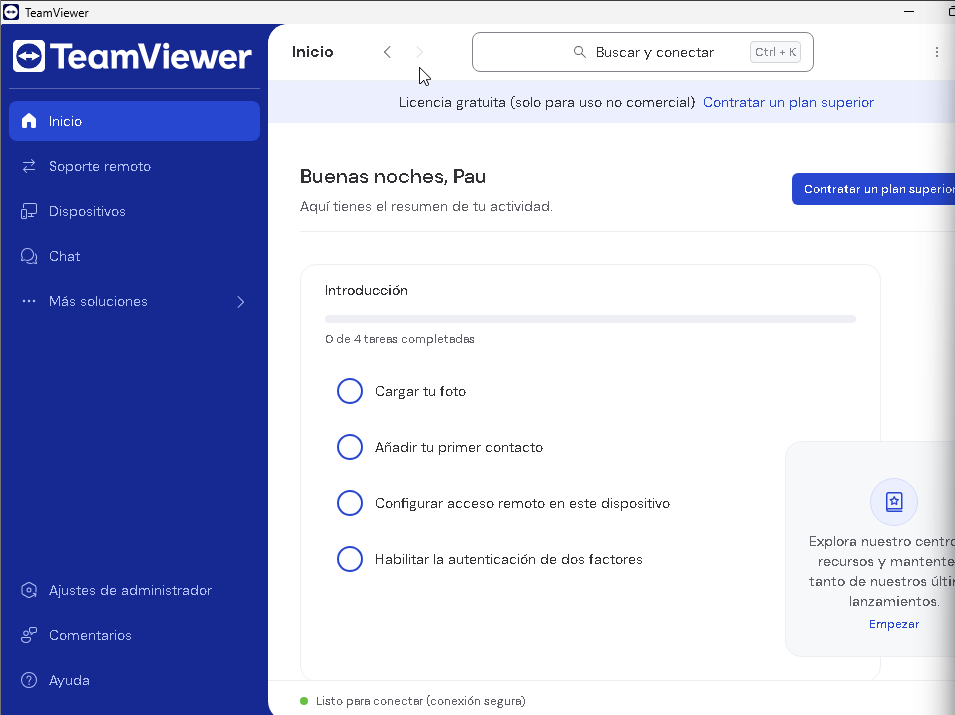
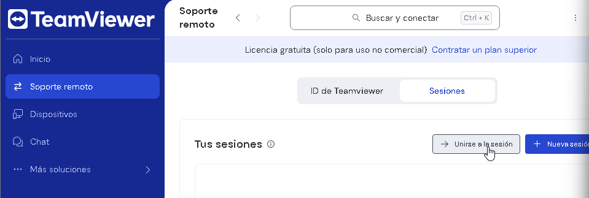
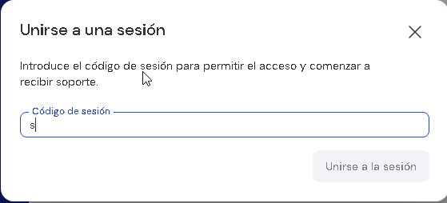

# T07: Accés remot. Serveis d’assistència remota
### Fet per: Pau Guerrero i Vicenç Obiol
---

Cerquem TeamViewer des de qualsevol navegador per poder connectar-nos de manera ràpida i segura. Aquesta eina ens permet veure i controlar l’ordinador del client sense necessitat que ell faci configuracions complicades.

---

El descarreguem des de la pàgina web oficial per assegurar-nos que tenim la versió més segura i actualitzada.

---

Esperem que es completi la descàrrega abans de començar la instal·lació.

---

Fem clic a Acceptar i continuar per instal·lar el programa al nostre ordinador.

---

Acceptem els acords i condicions i seguim amb la instal·lació. Això garanteix que tot funcioni correctament i de manera segura.

---

Quan arribem a la pantalla principal, hem de crear un compte si és la primera vegada que utilitzem TeamViewer. Si ja tenim compte, només cal iniciar sessió.

---

Així accedim a la pàgina principal del nostre usuari, des d’on podrem iniciar o unir-nos a sessions de suport remot.

---

Al menú de l’esquerra, anem a Suport Remot i seleccionem Unir-se a una sessió per connectar-nos a l’ordinador del client de manera immediata.

---

Per unir-nos a la sessió, introduïm el codi que ens proporciona la persona que vol connectar-se. A continuació, hem de donar-li permís perquè pugui accedir i treballar remotament al nostre dispositiu.

---

I ja està! L’usuari pot connectar-se i controlar el dispositiu remotament sense problemes. 

---

### Recomanacions per a Sessions Segures:
No desar contrasenyes del client – Cada sessió genera una contrasenya nova per protegir la seguretat.

Tancar sempre la sessió – Quan acabi el suport, cal tancar la connexió per evitar accessos no autoritzats.

Utilitzar accés amb compte – Per connexions recurrents, configurar accés fàcil amb compte i autenticació de seguretat.

Informar al client – Explicar al client quines accions realitzarem durant la sessió i què ha de fer, per mantenir transparència i confiança.
