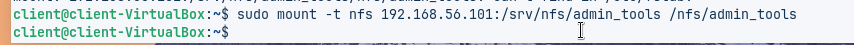
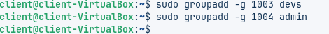

# Guia servei NFS — Versió ampliada

A continuació tens la guia amb **més informació en cada punt**, mantenint l'estructura original però afegint detalls útils.

---

## 1. Actualitzar el servidor o la màquina

Abans de configurar res, és important assegurar-se que el sistema està al dia per evitar errors i tenir els últims pegats de seguretat.

```bash
sudo apt update && sudo apt upgrade -y
```


Aquesta comanda:

* Actualitza la llista de paquets disponibles.
* Instal·la les últimes versions dels paquets que ja tens.
* Millora estabilitat i seguretat del sistema.

---

## 1.1 Creació de grups personalitzats

Els grups permeten gestionar permisos d'una manera més organitzada. Créem dos grups:

* **devs** → per als desenvolupadors
* **admin** → per als administradors del sistema

```bash
sudo groupadd devs
sudo groupadd admin
```

Aquests grups s'utilitzaran per assignar permisos de lectura, escriptura o gestió sobre carpetes compartides.


---

## 2. Creació dels nous usuaris

Per crear un usuari nou utilitzem **adduser**, que és interactiu i més complet que *useradd*.

```bash
sudo adduser nom_del_usuari
```


Aquesta comanda:

* Crea la nova identitat d’usuari.
* Assigna automàticament UID i GID.
* Genera el directori personal `/home/usuari`.
* Solicita contrasenya i dades opcionals.
* Assigna l’usuari al grup per defecte.

---

## 2.1 Configuració dels UID coherents

Perquè NFS funcioni correctament, els UID i GID dels usuaris han de coincidir entre servidor i client.


```bash
sudo usermod -u 1001 dev01
sudo usermod -u 1002 admin01
```


Això garanteix que els permisos siguin reconeguts igual en tots els ordinadors.

---

## 3. Instal·lar i configurar NFS

Instal·lem el servei principal del servidor NFS:


```bash
sudo apt install nfs-kernel-server
```

Això instal·la les eines necessàries per compartir carpetes via xarxa.

---

## 3.1 Crear les carpetes a compartir


```bash
sudo mkdir -p /srv/nfs/devs-projectes
sudo mkdir -p /srv/nfs/admin_tools
```

Aquestes carpetes contindran els fitxers que compartirem amb els diferents grups.

---

## 3.2 Editar l’arxiu d’exports


Les línies típiques que apareixen a l'arxiu **/etc/exports** (com a la imatge) són:

```
/srv/nfs/devs-projectes  *(rw,sync,no_subtree_check)
/srv/nfs/admin_tools     *(rw,sync,no_subtree_check)
```

L’arxiu `/etc/exports` defineix quines carpetes es comparteixen i amb quins permisos.

```bash
sudo nano /etc/exports
```

Aquí pots definir opcions com *rw*, *sync*, *no_subtree_check*, etc.

---

## 3.3 Iniciar i habilitar el servei

```bash
sudo systemctl start nfs-kernel-server
```


Així el servei s’iniciarà automàticament en reiniciar la màquina.

---

## 3.4 Preparar el client Linux

Instal·lem les eines NFS al client:


```bash
sudo apt install nfs-common
```

Aquest paquet permet muntar carpetes remotes NFS.

---

## 3.5 Crear els punts de muntatge

```bash
sudo mkdir /srv/nom_de_la_carpeta
```


Aquests directoris actuen com a punts d'accés a les carpetes remotes.

---

## 3.6 Muntar la carpeta NFS manualment

La comanda que habitualment apareix a la imatge és:



```
sudo mount -t nfs IP_DEL_SERVIDOR:/srv/nfs/devs-projectes /srv/devs-projectes
```

`sudo mount -t nfs IP_DEL_SERVIDOR:/srv/nfs/admin_tools /srv/admin_tools`

```bash
sudo mount -t nfs IP_DEL_SERVIDOR:/ruta/remota /ruta/local
```

Això et permet provar si el servei està funcionant correctament.

---

## 3.7 Permisos de la carpeta

És important verificar que:

* Els permisos coincideixin entre servidor i client.
* Els UID/GID siguin iguals.
* Els grups estiguin correctament creats.


---

## Afegir grups amb el mateix UID al client

```bash
sudo groupadd -g UID nom_del_grup
```


Això manté coherència entre màquines.

---

## Afegir usuaris amb el mateix UID


```bash
sudo useradd -m -u 1001 -g GID nom_usuari
```

Amb això, els permisos NFS funcionaran correctament.

---

## Comprovar els grups

```bash
cat /etc/group | tail
```


Permet validar que s'han creat correctament.

---

## Editar /etc/fstab per muntatge automàtic

```bash
sudo nano /etc/fstab
```

