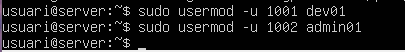

# Guia servei NFS
---
## 1. lo primer que sera es updatejar el servidosr ho la maquina:  

Abans de tot haurem de posar la màquina al dia.  
```bash
sudo apt update && sudo apt upgrade -y
```


## 1. Creació de grups personalitzats

Després es creen dos grups addicionals per organitzar permisos:

devs → Grup de desenvolupadors


admin → Grup d’administradors


🔧 Comandes utilitzades:
``` bash
sudo groupadd devs
sudo groupadd admin
```

...

## 2 reació d’els nou usuari
A la captura es mostra la creació de l’usuari dev01 mitjançant adduser.


Comanda utilitzada:
``` bash
sudo adduser nom del nou usuari
```
Què fa aquesta comanda?

- Crea l’usuari 

- Assigna automàticament un UID i un GID dins el rang d’usuaris locals.

- Crea el directori personal /home/nom del usuari.

- Copia els fitxers inicials de /etc/skel.

- Demana una contrasenya nova.

- Permet afegir informació addicional (opcional).

- Finalment, afegeix l’usuari al grup suplementari users (a Debian/Ubuntu).

### 2.1 configuracio dels gups (uid coarents) 
```` bash
sudo usermod -u 1001 dev01
sudo usermod -u 1002 admin01
````



El UID (User ID) del usuario dev01 a 1001
El UID del usuario admin01 a 1002

## 3 instalar y configurar nfs
Ejecuta:
```
sudo apt install nfs-kernel-server
```


### 3.1 Crear la carpeta que compartirás
``` bash
sudo mkdir -p /srv/nfs/devs-projectes
sudo mkdir -p /srv/nfs/admin_tools
```


### 3.2 Editar al archiu de exportación NFS
```` bash
sudo nano /etc/exports
````


### 3.3 Inicia i habilitar el servei
``` bash
sudo systemctl start nfs-kernel-server
```


### 3.4 Muntar el recurs NFS des d’un altre client Linux

Al client, instal·la NFS:
```` bashç
sudo apt install nfs-common
````


### 3.5 crear el punt de montatge 
